## Python
Anaconda: https://www.anaconda.com/products/individual

`conda install pip`

`pip install -r requirements.txt`

Jupyter: https://jupyter.org

Jupyter goes with Anaconda distribution, so no need to install it separately

## Docker

1) WSL + Docker Desktop: https://hub.docker.com/editions/community/docker-ce-desktop-windows

2) Docker CE on Linux inside virtual machine.

### Installing VirtualBox and creating virtual machine

We cannot use virtual machine Docker and WSL Docker simultaneously. If you use WSL 2 it is obligated to disable "Virtual Machine Platform" Windows feature:

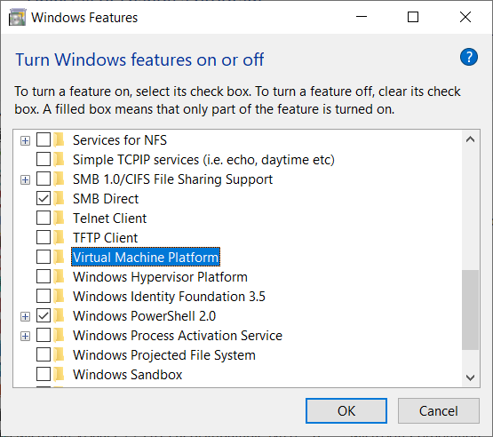

Install Oracle VirtualBox: https://www.oracle.com/ru/virtualization/technologies/vm/downloads/virtualbox-downloads.html

Create virtual machine with 6 GB RAM and 85 GB storage at least.

Open of your VM settings and check "Enable Nested VT-x/AMD-V" and define number of processor:

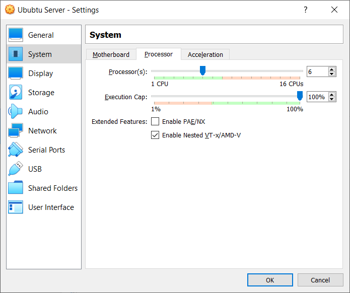

If your "Enable Nested VT-x/AMD-V" is inactive, you should execute command "VBoxManage.exe modifyvm <vm-name> --nested-hw-virt on" VBoxManage.exe is located in C:\Program Files\Oracle\VirtualBox folder.

It is time to install OS:

Download image (i will use Ubuntu Server 21.10 - https://releases.ubuntu.com/21.10/ubuntu-21.10-live-server-amd64.iso) and mount it.

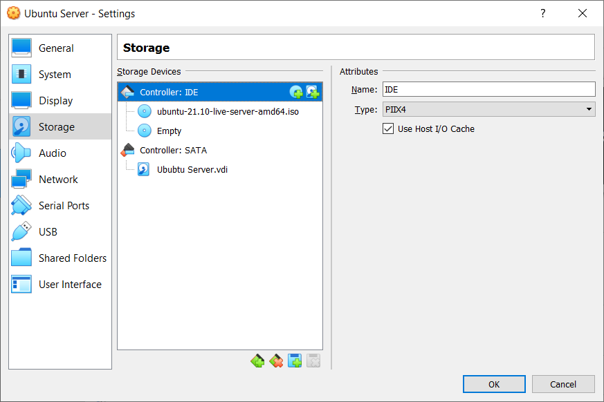

At last let's configure port forwarding for SSH:

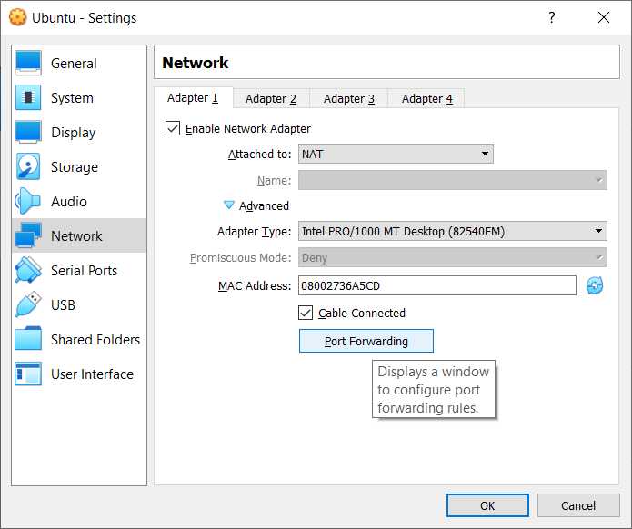

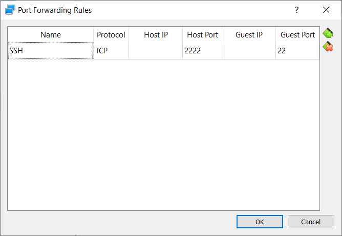

### Setting up Linux (Ubuntu 21.10)

Start VM and install OS as usual:

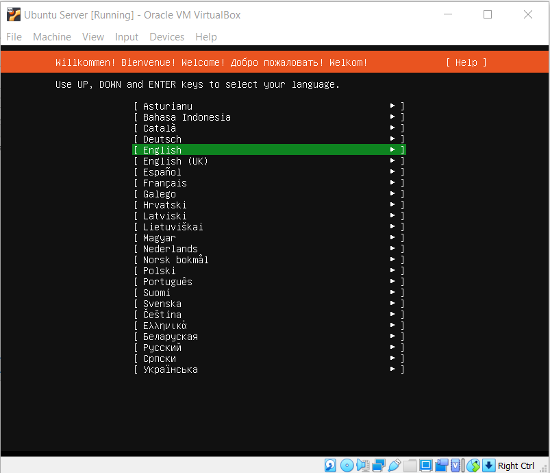

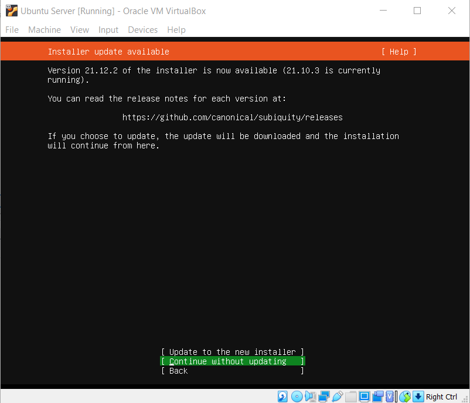

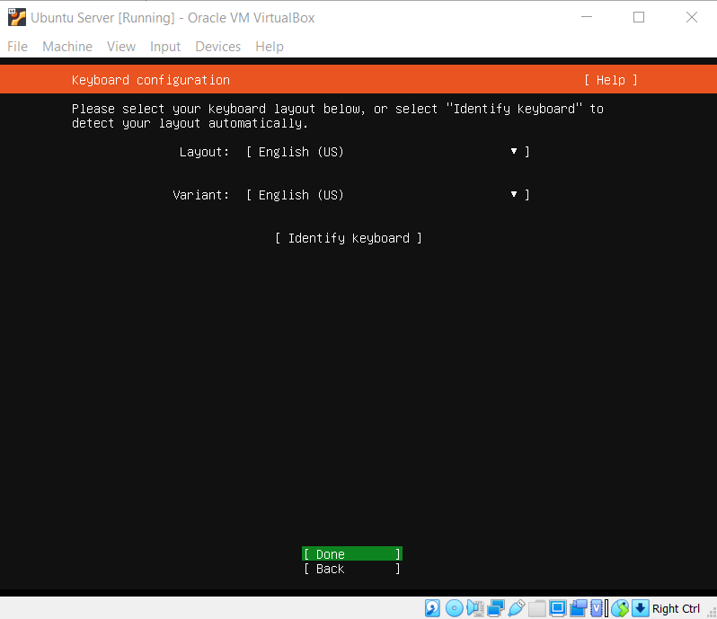

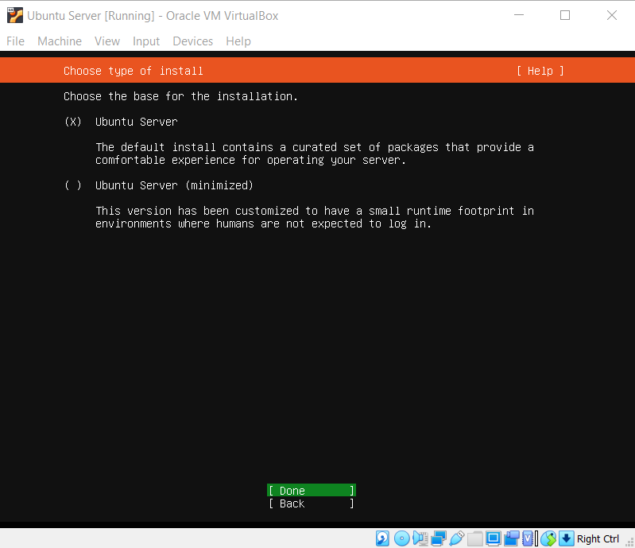

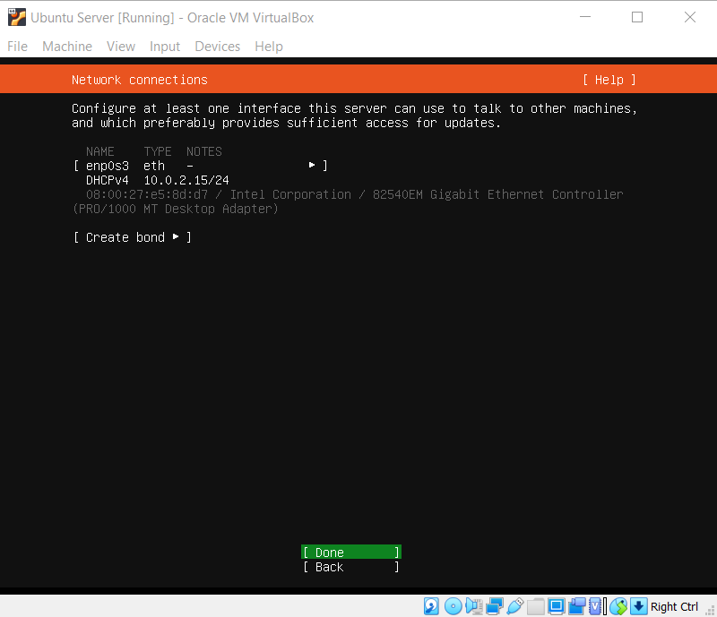

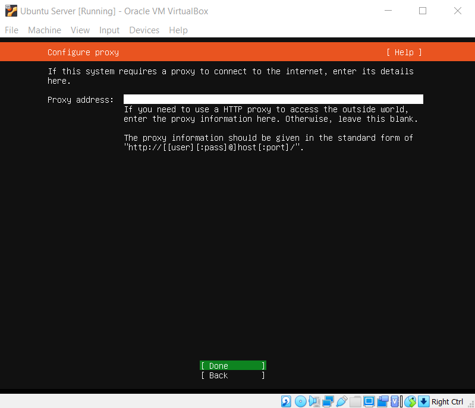

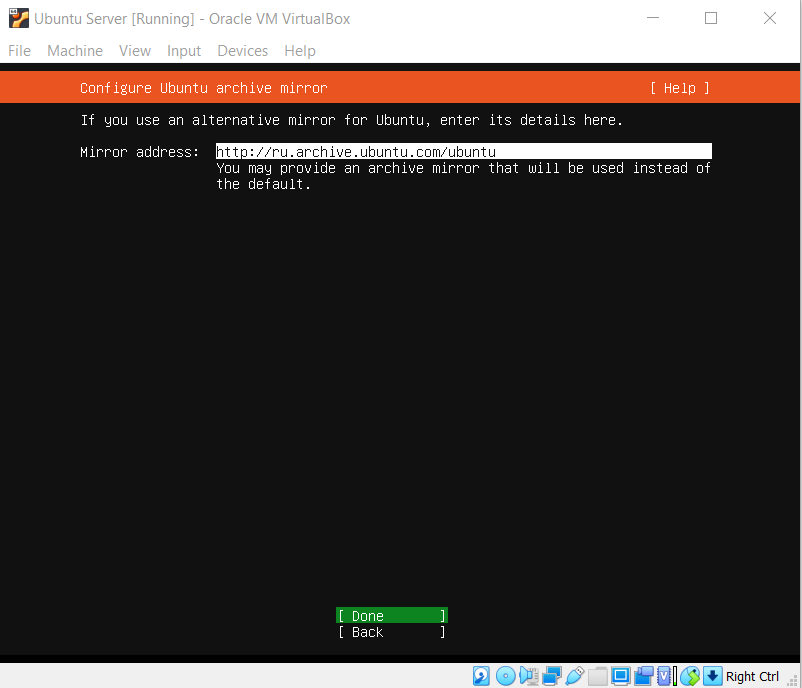

You can set up disk partitioning on your own (more information about it https://ubuntu.com/server/docs/install/storage)

I prefer this way:

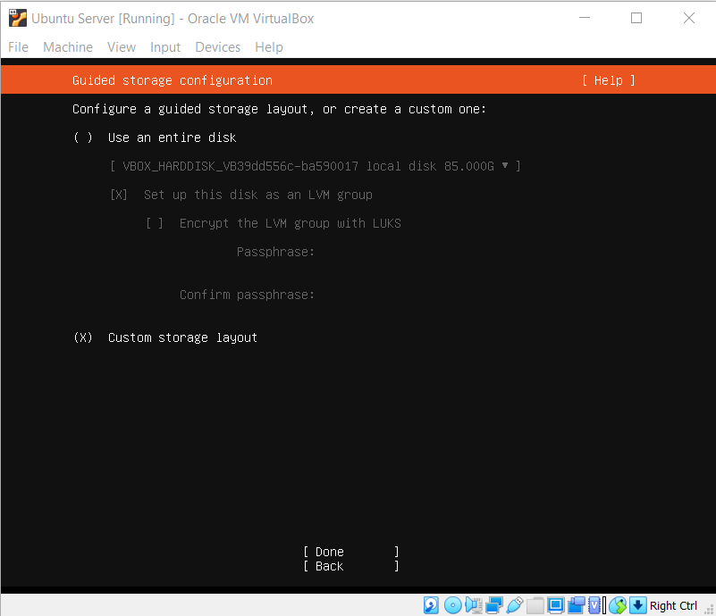

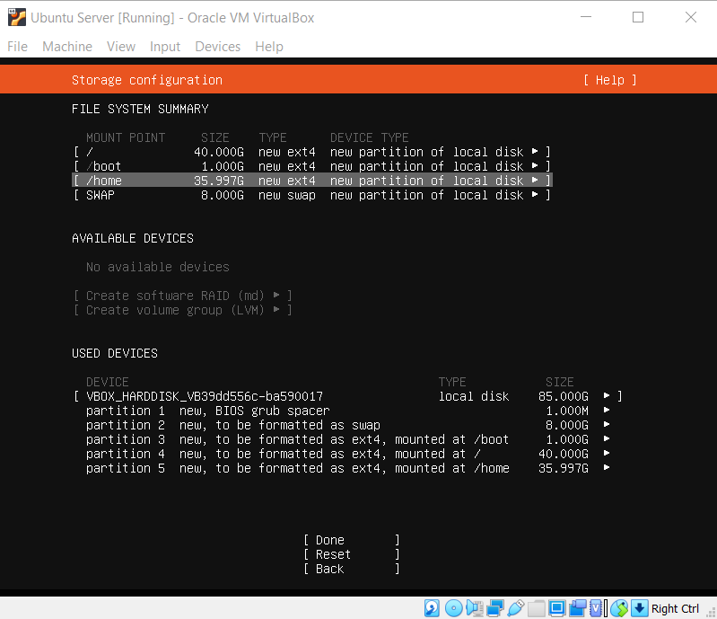

Don't forget to check OpenSSH server installation:

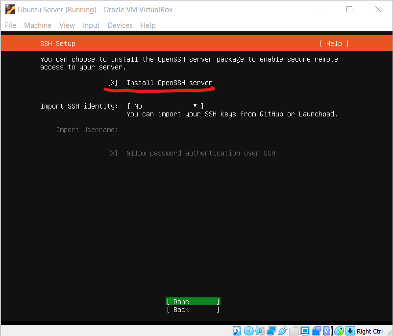

Don't setup any features, because of old versions in Ubuntu repositories!

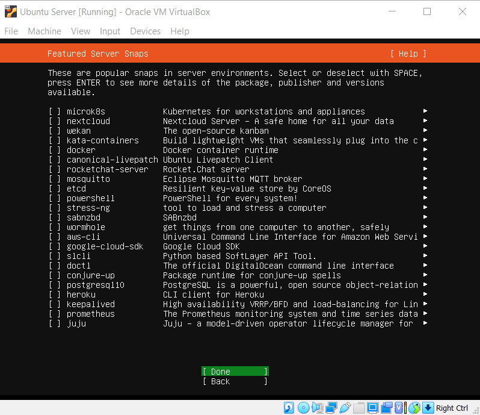

Wait until installation is done and reboot.

Now you can connect to VM:

`ssh <vm_user_name>@localhost -p 2222`

### Enable SSH

If you use PowerShell and it returns error that 'ssh' is not recognized:

```
PS C:\Users\{user_name}> ssh {user_name}@localhost -p 2222

ssh : The term 'ssh' is not recognized as the name of a cmdlet, function, script file, or operable program. Check the
spelling of the name, or if a path was included, verify that the path is correct and try again.
```

Open PowerShell as administrator - right mouse button click on Start menu and choose "Windows PowerShell (Admin)"

And execute command to install the OpenSSH Client and restart PowerShell:

`Add-WindowsCapability -Online -Name OpenSSH.Client~~~~0.0.1.0`

Actual instruction: https://docs.microsoft.com/ru-ru/windows-server/administration/openssh/openssh_install_firstuse

### Installing required software

#### Docker
The Docker installation package available in the official Ubuntu repository may not be the latest version. To ensure we get the latest version, we’ll install Docker from the official Docker repository. To do that, we’ll add a new package source, add the GPG key from Docker to ensure the downloads are valid, and then install the package.

Actual instruction: https://docs.docker.com/engine/install/ubuntu/

```
sudo apt-get update
 
sudo apt-get install \
    ca-certificates \
    curl \
    gnupg \
    lsb-release
 
curl -fsSL https://download.docker.com/linux/ubuntu/gpg | sudo gpg --dearmor -o /usr/share/keyrings/docker-archive-keyring.gpg
 
echo \
  "deb [arch=$(dpkg --print-architecture) signed-by=/usr/share/keyrings/docker-archive-keyring.gpg] https://download.docker.com/linux/ubuntu \
  $(lsb_release -cs) stable" | sudo tee /etc/apt/sources.list.d/docker.list > /dev/null
 
sudo apt-get update
 
sudo apt-get install docker-ce docker-ce-cli containerd.io
```

Create "docker" group and add it to current user:

```
sudo groupadd docker
 
sudo usermod -aG docker $USER
```

Relogin and check:

```
docker run hello-world
```

#### Docker compose

Although we can install Docker Compose from the official Ubuntu repositories, it is several minor version behind the latest release, so we’ll install Docker Compose from the Docker’s GitHub repository.

Actual instruction: https://docs.docker.com/compose/install/#install-compose-on-linux-systems

```
sudo curl -L "https://github.com/docker/compose/releases/download/1.29.2/docker-compose-$(uname -s)-$(uname -m)" -o /usr/local/bin/docker-compose
 
sudo chmod +x /usr/local/bin/docker-compose
 
sudo ln -s /usr/local/bin/docker-compose /usr/bin/docker-compose
```

Place the completion script in /etc/bash_completion.d/ folder

```
sudo curl \
-L https://raw.githubusercontent.com/docker/compose/1.29.2/contrib/completion/bash/docker-compose \
-o /etc/bash_completion.d/docker-compose
```

Reload terminal.

#### Docker ctop

This tool allows to control and interact with containers.

Actual instruction: https://github.com/bcicen/ctop

```
echo "deb http://packages.azlux.fr/debian/ buster main" | sudo tee /etc/apt/sources.list.d/azlux.list
 
wget -qO - https://azlux.fr/repo.gpg.key | sudo apt-key add -
 
sudo apt update
 
sudo apt install docker-ctop
```

Addition packages for python packages

`sudo apt install python3-dev gcc libkrb5-dev g++ libsasl2-dev build-essential libldap2-dev slapd ldap-utils tox lcov valgrind`

Check python version and install venv. For example for python 3.9:

`sudo apt install python3.9-venv`

#### Create virtual environment

```
python3 -m venv venv
 
source venv/bin/activate
 
pip install wheel
 
pip install -r requirements/local_dev.txt
```

#### Run project for development

Build image:

`docker build . -f ./build/docker/Dockerfile -t aap-datahub-etl:latest`

Run containers:

`docker-compose -f docker-compose-dev.yml up -d`

Add port forwarding rule for web(8088 for example):


Install Apache Spark:
https://spark.apache.org/downloads.html


